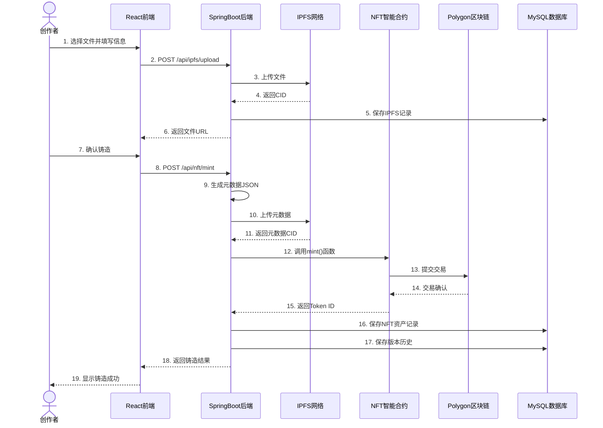
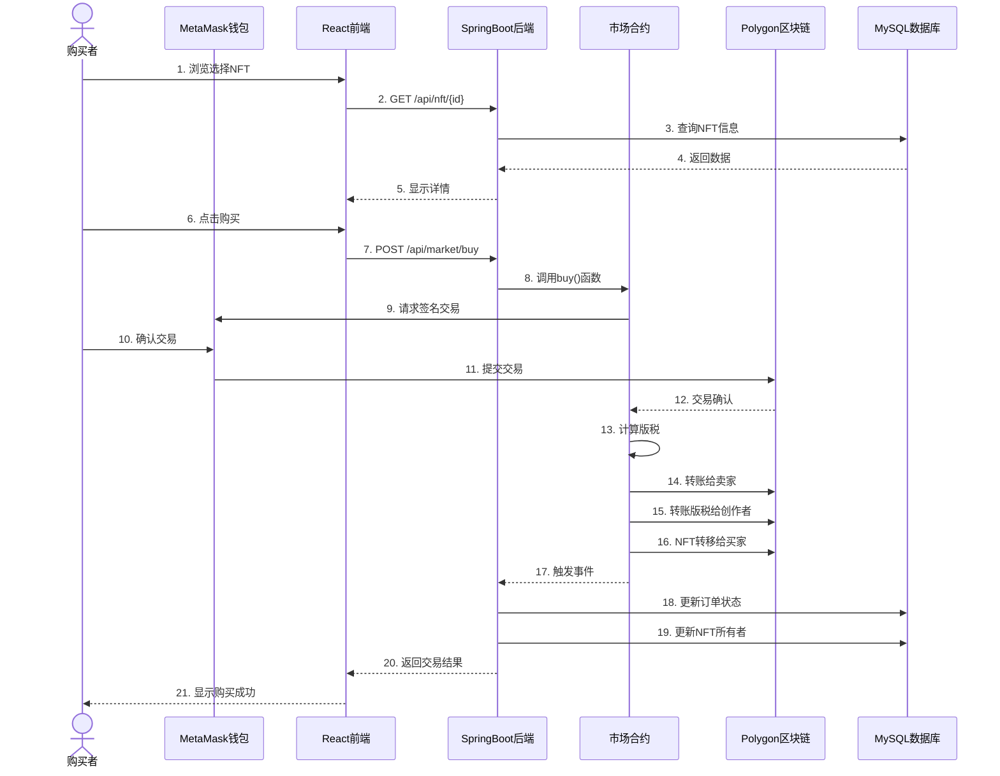
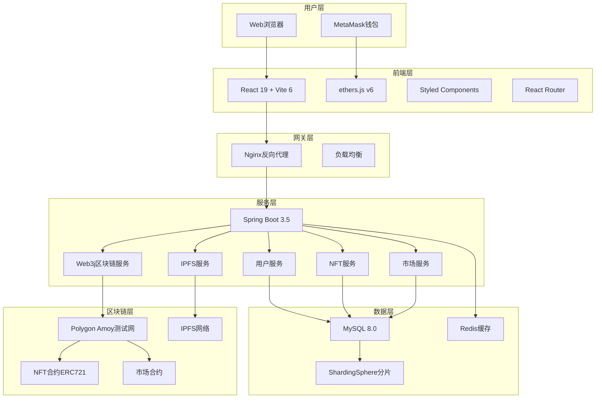
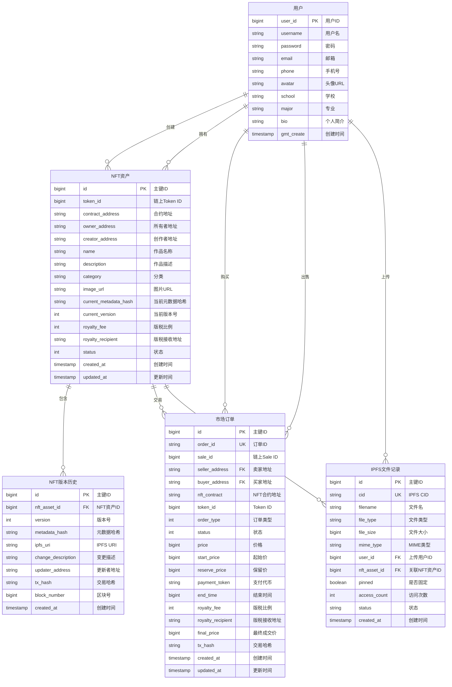
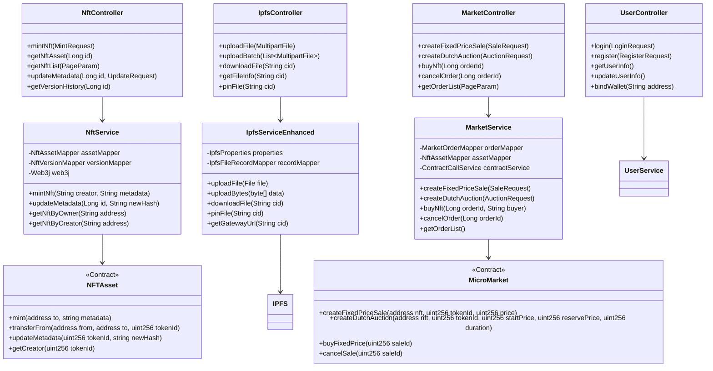
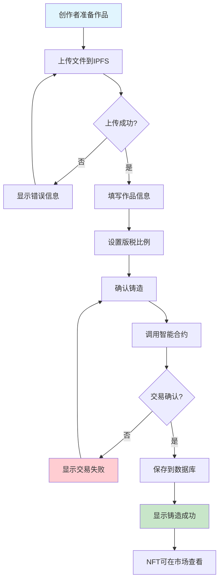
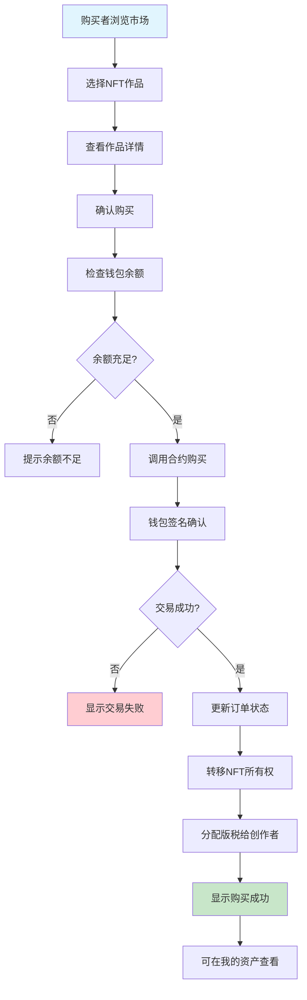
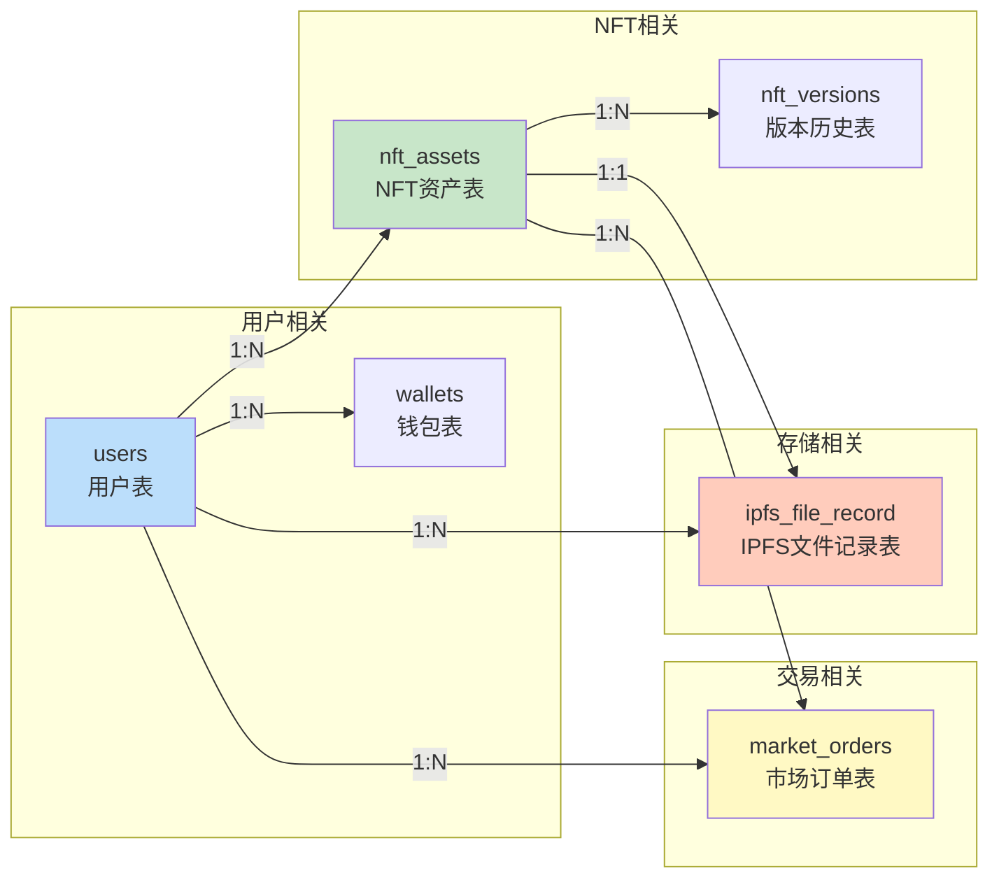
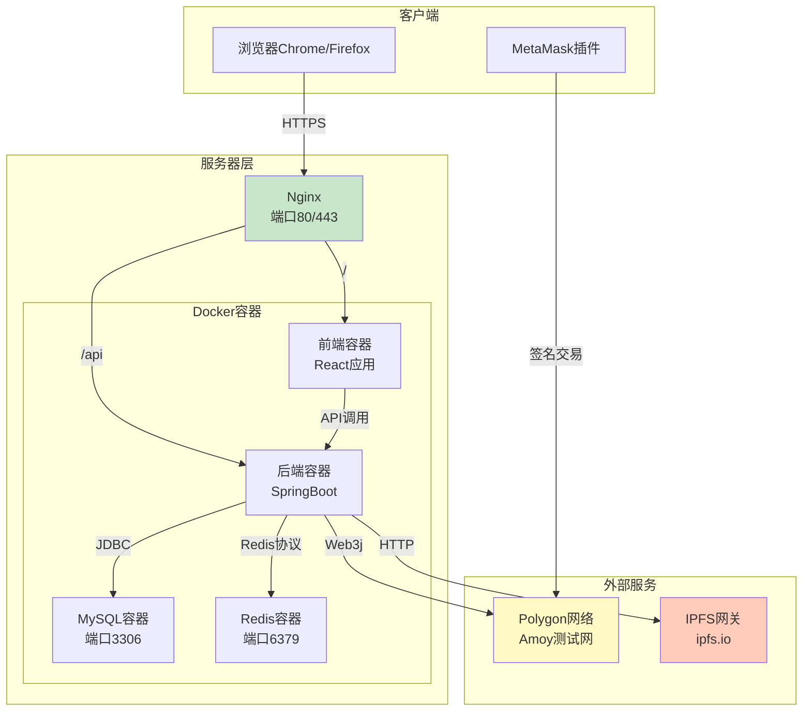

# 学生创意成果NFT交易系统 - 系统图表集

使用 [Mermaid Live Editor](https://mermaid.live/) 在线预览这些图表

---

## 1. 系统用例图

```mermaid
graph TB
    subgraph 学生创作者
        C1[连接钱包]
        C2[上传创意成果]
        C3[铸造NFT]
        C4[版本更新]
        C5[管理作品]
        C6[设置销售价格]
        C7[查看收益]
    end

    subgraph 购买者
        B1[浏览市场]
        B2[搜索作品]
        B3[查看详情]
        B4[购买NFT]
        B5[查看持有资产]
        B6[转售NFT]
    end

    subgraph 平台管理员
        A1[用户管理]
        A2[内容审核]
        A3[交易监控]
        A4[数据统计]
        A5[系统配置]
    end

    subgraph NFT交易平台系统
        S1[钱包认证模块]
        S2[IPFS存储模块]
        S3[NFT铸造模块]
        S4[版本控制模块]
        S5[市场交易模块]
        S6[智能合约模块]
    end

    C1 --> S1
    C2 --> S2
    C3 --> S3
    C3 --> S6
    C4 --> S4
    C5 --> S3
    C6 --> S5
    C7 --> S5

    B1 --> S5
    B2 --> S5
    B3 --> S3
    B4 --> S5
    B4 --> S6
    B5 --> S3
    B6 --> S5

    A1 --> S1
    A2 --> S3
    A3 --> S5
    A4 --> S5
    A5 --> S6
```

---

## 2. NFT铸造时序图

---

## 3. NFT购买时序图

---

## 4. 系统架构图

---

## 5. E-R图（实体关系图）

---

## 6. 类图

---

## 7. NFT铸造流程图

---

## 8. NFT购买流程图

---

## 9. 数据库表关系图

---

## 10. 部署架构图

---

## 使用说明

### 在 VS Code 中查看
1. 安装插件：Markdown Preview Mermaid Support
2. 打开本文档，按 Ctrl+Shift+V 预览

### 在 Typora 中查看
1. 偏好设置 → Markdown → 启用 Mermaid 图表
2. 文档会自动渲染图表

### 在线编辑
访问 https://mermaid.live/ 复制代码在线编辑和导出图片（PNG/SVG/PDF）